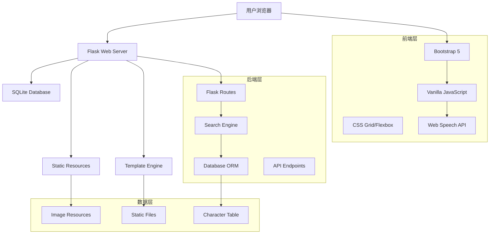

# 🏗️ 项目架构与技术文档 (Architecture & Technical Documentation)

## 📐 系统架构概览



## 🗂️ 数据库架构

### 主表结构 (httpcn_zi)
```sql
CREATE TABLE httpcn_zi (
    id INTEGER PRIMARY KEY,
    zi TEXT,                    -- 汉字
    pinyin TEXT,               -- 拼音(带声调)
    pinyin_toneless TEXT,      -- 拼音(无声调)
    bushou TEXT,               -- 部首
    bshs INTEGER,              -- 部首笔画数
    zbh INTEGER,               -- 总笔画数
    kxzd_zbh INTEGER,          -- 康熙字典笔画数
    wb86 TEXT,                 -- 五笔86码
    wb98 TEXT,                 -- 五笔98码
    unicode TEXT,              -- Unicode编码
    hzwx TEXT,                 -- 汉字五行
    jxyd TEXT,                 -- 吉凶寓意
    sfcyz TEXT,                -- 是否常用字
    xmx TEXT,                  -- 姓名学
    bxdx TEXT,                 -- 笔顺读写
    jbjs TEXT,                 -- 基本解释
    xhzdxxjs TEXT,             -- 新华字典详细解释
    hydzdjs TEXT,              -- 汉语大字典解释
    kxzdjs TEXT,               -- 康熙字典解释
    swjzxj TEXT,               -- 说文解字详解
    swjzxjtp TEXT,             -- 说文解字详解图片
    zyybpic TEXT,              -- 字源演变图片
    xgsf TEXT,                 -- 相关书法
    xgcy TEXT,                 -- 相关词语
    xgcy2 TEXT,                -- 相关成语
    xgsc TEXT,                 -- 相关诗词
    kxzdpic TEXT               -- 康熙字典图片
);

-- 索引优化
CREATE INDEX idx_pinyin ON httpcn_zi(pinyin);
CREATE INDEX idx_pinyin_toneless ON httpcn_zi(pinyin_toneless);
CREATE INDEX idx_bushou ON httpcn_zi(bushou);
CREATE INDEX idx_zbh ON httpcn_zi(zbh);
CREATE INDEX idx_wb86 ON httpcn_zi(wb86);
```

### 数据统计
- **总记录数**: 19,636条汉字
- **数据字段**: 27个详细属性
- **图片资源**: ~56,000张支持图片
- **数据来源**: 康熙字典、新华字典、说文解字等权威资料

## 🌐 Web应用架构

### MVC架构模式
```python
# Model层 - 数据访问
def search_characters(query, search_type, page):
    """数据查询和处理逻辑"""
    
def get_character_by_id(char_id):
    """单个字符详情获取"""

# View层 - 模板渲染
@app.route('/search')
def search():
    """搜索页面路由"""
    return render_template('search.html', results=results)

# Controller层 - 业务逻辑
class SearchController:
    def process_search(self, query, search_type):
        """搜索请求处理"""
```

### 路由系统
```python
# 页面路由
@app.route('/')                          # 首页
@app.route('/search')                    # 搜索页面
@app.route('/character/<int:char_id>')   # 字符详情
@app.route('/pinyin-table')              # 拼音音节表

# API路由
@app.route('/api/search')                # 搜索API
@app.route('/api/character/<int:id>')    # 字符API
@app.route('/api/stats')                 # 统计API

# 资源路由
@app.route('/Upload/<path:filename>')    # 图片资源服务
```

## 🎨 前端架构设计

### 组件化设计
```javascript
// 全局对象命名空间
window.ChineseDictionary = {
    // TTS模块
    playPinyin: function(text) {},
    playPinyinWithFallback: function(text) {},
    
    // 搜索模块
    search: {
        handleQuery: function() {},
        updateResults: function() {}
    },
    
    // UI模块
    ui: {
        toggleView: function() {},
        initializeTooltips: function() {}
    }
};
```

### CSS架构
```css
/* 1. 基础样式 */
:root {
    --primary-color: #007bff;
    --success-color: #28a745;
    --character-font: 'SimSun', serif;
}

/* 2. 布局组件 */
.character-grid { /* 网格布局 */ }
.character-card { /* 卡片组件 */ }

/* 3. 交互状态 */
.speaking { /* TTS播放状态 */ }
.loading { /* 加载状态 */ }

/* 4. 响应式设计 */
@media (max-width: 768px) { /* 移动端适配 */ }
```

## 🔧 核心功能模块

### 1. 搜索引擎模块
```python
class SearchEngine:
    """
    多维度搜索引擎
    支持: 汉字、拼音、五笔、部首、笔画、Unicode、全文搜索
    """
    
    SEARCH_TYPES = {
        'zi': '汉字搜索',
        'pinyin': '拼音搜索(支持带/无声调)',
        'wubi': '五笔搜索',
        'bushou': '部首搜索',
        'zbh': '笔画数搜索',
        'unicode': 'Unicode搜索',
        'all': '全文搜索'
    }
    
    def build_query(self, search_type, query):
        """构建SQL查询语句"""
        
    def execute_search(self, sql, params):
        """执行搜索并返回结果"""
```

### 2. TTS语音模块
```javascript
class TTSEngine {
    constructor() {
        this.primaryMethod = 'webSpeechAPI';
        this.fallbackMethod = 'googleTTS';
        this.chineseVoices = [];
    }
    
    // 智能中文语音选择
    selectChineseVoice() {
        const priorities = [
            v => v.lang === 'zh-CN' && v.name.includes('Mandarin'),
            v => v.lang === 'zh-CN' && v.name.includes('Chinese'),
            v => v.lang.startsWith('zh-')
        ];
    }
    
    // 多重备选播放
    async playWithFallback(text) {
        try {
            await this.webSpeechAPI(text);
        } catch {
            await this.googleTTS(text);
        }
    }
}
```

### 3. 拼音音节表模块
```javascript
const PinyinTable = {
    // 音节数据结构
    data: {
        categories: [
            { name: '单韵母', class: 'simple-vowel' },
            { name: '复韵母', class: 'compound-vowel' },
            { name: '前鼻韵母', class: 'front-nasal' },
            { name: '后鼻韵母', class: 'back-nasal' },
            { name: '三拼音节', class: 'triple-spell' }
        ]
    },
    
    // 动态表格生成
    generateTable() {
        // 数据驱动的HTML生成
    },
    
    // 交互事件绑定
    bindEvents() {
        // 点击发音、声调选择等
    }
};
```

## 📱 响应式设计架构

### 断点系统
```css
/* 移动设备优先的断点设计 */
/* Extra small devices (phones) */
@media (max-width: 575.98px) { }

/* Small devices (landscape phones) */
@media (min-width: 576px) and (max-width: 767.98px) { }

/* Medium devices (tablets) */
@media (min-width: 768px) and (max-width: 991.98px) { }

/* Large devices (desktops) */
@media (min-width: 992px) and (max-width: 1199.98px) { }

/* Extra large devices (large desktops) */
@media (min-width: 1200px) { }
```

### 自适应布局策略
```css
/* 网格系统 */
.character-grid {
    display: grid;
    grid-template-columns: repeat(auto-fill, minmax(250px, 1fr));
    gap: 1rem;
}

/* 弹性布局 */
.search-form {
    display: flex;
    flex-wrap: wrap;
    gap: 0.5rem;
}

/* 响应式字体 */
.character-zi {
    font-size: clamp(1.5rem, 4vw, 3rem);
}
```

## 🚀 性能优化架构

### 1. 数据库优化
```sql
-- 查询优化
PRAGMA journal_mode = WAL;          -- 写前日志模式
PRAGMA synchronous = NORMAL;        -- 平衡安全性和性能
PRAGMA cache_size = 10000;          -- 缓存页面数
PRAGMA temp_store = memory;         -- 临时数据存储在内存
```

### 2. 前端性能策略
```javascript
// 防抖搜索
const debouncedSearch = debounce(function(query) {
    performSearch(query);
}, 300);

// 图片懒加载
const imageObserver = new IntersectionObserver((entries) => {
    entries.forEach(entry => {
        if (entry.isIntersecting) {
            loadImage(entry.target);
        }
    });
});
```

### 3. 缓存策略
```python
# Flask应用缓存
from functools import lru_cache

@lru_cache(maxsize=1000)
def get_character_details(char_id):
    """缓存字符详情查询"""
    
# 静态资源缓存
@app.after_request
def add_cache_headers(response):
    if request.endpoint == 'static':
        response.cache_control.max_age = 86400  # 24小时
    return response
```

## 🔐 安全架构设计

### 1. 输入验证
```python
import re
from flask import escape

def validate_search_input(query):
    """搜索输入验证"""
    if not query or len(query) > 100:
        return False
    
    # 防止SQL注入
    dangerous_chars = ['--', ';', '/*', '*/', 'xp_']
    return not any(char in query.lower() for char in dangerous_chars)

def sanitize_output(text):
    """输出清理"""
    return escape(text)
```

### 2. API安全
```python
from flask_limiter import Limiter
from flask_limiter.util import get_remote_address

# 请求限流
limiter = Limiter(
    app,
    key_func=get_remote_address,
    default_limits=["1000 per hour"]
)

@app.route('/api/search')
@limiter.limit("60 per minute")
def api_search():
    """限流的搜索API"""
```

## 📊 监控和日志架构

### 1. 日志系统
```python
import logging
from logging.handlers import RotatingFileHandler

# 配置日志
if not app.debug:
    file_handler = RotatingFileHandler(
        'logs/dictionary.log', 
        maxBytes=10240, 
        backupCount=10
    )
    file_handler.setFormatter(logging.Formatter(
        '%(asctime)s %(levelname)s: %(message)s [in %(pathname)s:%(lineno)d]'
    ))
    app.logger.addHandler(file_handler)
    app.logger.setLevel(logging.INFO)
```

### 2. 性能监控
```javascript
// 前端性能监控
window.performance.mark('search-start');
performSearch(query);
window.performance.mark('search-end');
window.performance.measure('search-duration', 'search-start', 'search-end');

// 错误监控
window.addEventListener('error', function(e) {
    console.error('JavaScript Error:', e.error);
    // 可以发送到监控服务
});
```

## 🔄 部署架构

### 1. 开发环境
```bash
# 本地开发
python app.py  # 开发服务器，端口5000

# 环境变量
export FLASK_ENV=development
export FLASK_DEBUG=1
```

### 2. 生产环境
```bash
# 使用Gunicorn部署
gunicorn -w 4 -b 0.0.0.0:5000 app:app

# 或使用uWSGI
uwsgi --http :5000 --wsgi-file app.py --callable app --processes 4
```

### 3. Docker部署
```dockerfile
FROM python:3.9-slim
WORKDIR /app
COPY requirements.txt .
RUN pip install -r requirements.txt
COPY . .
EXPOSE 5000
CMD ["gunicorn", "-w", "4", "-b", "0.0.0.0:5000", "app:app"]
```

## 📈 扩展架构规划

### 1. 微服务架构
```
├── 用户服务 (User Service)
├── 搜索服务 (Search Service)
├── 语音服务 (TTS Service)
├── 内容服务 (Content Service)
└── 网关服务 (API Gateway)
```

### 2. 数据层扩展
```sql
-- 用户表
CREATE TABLE users (
    id INTEGER PRIMARY KEY,
    username TEXT UNIQUE,
    email TEXT,
    created_at TIMESTAMP
);

-- 收藏表
CREATE TABLE favorites (
    user_id INTEGER,
    character_id INTEGER,
    created_at TIMESTAMP,
    FOREIGN KEY(user_id) REFERENCES users(id),
    FOREIGN KEY(character_id) REFERENCES httpcn_zi(id)
);

-- 搜索历史表
CREATE TABLE search_history (
    user_id INTEGER,
    query TEXT,
    search_type TEXT,
    timestamp TIMESTAMP
);
```

## 🎯 架构优势总结

1. **模块化设计**: 各功能模块相对独立，便于维护和扩展
2. **分层架构**: 清晰的MVC分层，职责分明
3. **响应式布局**: 适配多种设备，用户体验一致
4. **性能优化**: 多级缓存和懒加载策略
5. **安全可靠**: 输入验证和输出清理机制
6. **可扩展性**: 为未来功能扩展预留接口

---

**🏗️ 这个架构文档提供了项目的技术蓝图，为未来的维护和扩展提供了清晰的指导！**